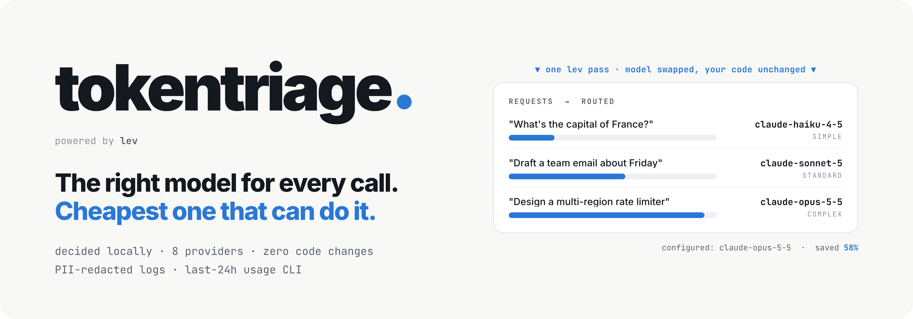

[](assets/hero.png)

# tokentriage
(Open-Source LLM Cost Router)

*Powered by [LEV](https://github.com/InterfazeAI/lev), a System 1 decision model from InterfazeAI. Many thanks to Abhinav and the Interfaze team for developing lev. tokentriage is an independent project built on top of it.*


[](LICENSE)

[](https://github.com/InterfazeAI/lev)

> **🧪 Beta: still under active testing.** Settings, defaults and APIs may change between commits, and some parts are incomplete (see [Known limitations](#known-limitations)). Try it in development or with evaluation mode before relying on it in production, and please [report issues](https://github.com/sathyalog/tokentriage/issues).

**tokentriage leverages LEV—a fast, System 1 decision engine—to evaluate prompt complexity and predict the cheapest suitable model in milliseconds without the latency of generative text models.** You keep writing `ChatAnthropic(model="claude-opus-5-5")`. tokentriage checks each request, and a greeting goes to Haiku while a hard reasoning task stays on Opus. Your code doesn't change and nothing is proxied: the decision happens inside your process, and the call still goes straight to your provider with your own API key.

**Key features**
- **One line to adopt:** `tokentriage.load_config()` routes LangChain chat models and direct Anthropic SDK / OpenAI SDK calls.
- **Same provider, your keys:** routing only moves between tiers of the provider you already use (cross-vendor is [opt-in via OpenRouter](#switching-vendors-with-openrouter-ladder-mode)). [Security details](docs/security.md).
- **Conversation-aware:** keeps each conversation on one model so prompt caching keeps working, and moves it to a better model when the user keeps re-asking the same question. [Details](docs/conversations.md).
- **Guardrails:** never picks a model that can't fit the request's context, attachments or tool use, and never touches fine-tuned models. [Rules](docs/security.md#guardrails).
- **Current model data:** `tokentriage models refresh` updates prices and capabilities and checks your tier models against what your API key can use. [Details](docs/models.md).
- **Visible costs:** every decision is logged with its cost and savings; `tokentriage usage` and evaluation mode show the totals and the quality. [Logs and usage](docs/observability.md), [evaluation](docs/evaluation.md).

---

## How it works
`tokentriage` intercepts outgoing chat model requests before they hit an external API. 

Instead of using a full generative LLM to classify user requests, `tokentriage` offloads routing decisions to LEV (a 4B System 1 classifier). LEV computes probabilities over decision tiers in a single forward pass with zero token-generation overhead.

1. You call a LangChain chat model as usual.
2. tokentriage builds a short summary of the request: the last user message, the system prompt, tools and attachments.
3. A **classifier** rates the request as `simple`, `standard` or `complex`.
4. tokentriage calls a copy of your chat model, switched to that tier's model from the **same provider**. Your API key and endpoint are unchanged, and your original object is never modified.

| Tier | Anthropic (default) | OpenAI (default) |
|------|---------------------|------------------|
| simple | `claude-haiku-4-5` | `gpt-6-luna` |
| standard | `claude-sonnet-5` | `gpt-6-sol` |
| complex | `claude-opus-5-5` | `gpt-6-astra` |

Tiers are configurable per provider (see [Configuration](#configuration)). Before using a cheaper model, tokentriage checks that it fits the request's context size, attachments and tool use; the rules are in [docs/security.md](docs/security.md#guardrails).

### Choosing a classifier backend

| | `heuristic` | `lev-local` | `lev-http` |
|---|---|---|---|
| **Decides with** | keyword and length rules | lev, inside your app | lev on a server you run (`lev serve`) |
| **Time per decision** | ~1 ms | tens of ms on a GPU (lev reports 69 ms on an H100); seconds on a CPU | network round trip plus the server's time (lev reports 414–654 ms from a laptop to an H100 in the cloud) |
| **Download and disk** | none | ~9.5 GB on first run, cached in `~/.cache/huggingface` | none on the app's machine |
| **Memory** | none | ~10 GB free RAM, or a GPU | none on the app's machine |
| **Works offline** | ✅ | ✅ after the first download | ✅ on a private network (needs the server) |
| **Scaling** | every instance, free | every instance loads its own copy | many instances share one server |
| **Falls back to the heuristic** on error or timeout | n/a | ✅ | ✅ |
| **Best for** | development, or when lev isn't available | a machine with a GPU or plenty of RAM | small machines, containers, many app instances |

lev's authors report 68.9% on their S1Bench decision benchmark; tokentriage has no published routing-accuracy figure yet. To measure routing quality on your own prompts, use [evaluation mode](docs/evaluation.md).

Whatever the backend, if a decision fails or takes longer than `timeout_s`, that call falls back to the heuristic, so your app never waits longer than `timeout_s` for a decision.

> **lev-local needs memory.** lev is a 0.2 GB adapter on a 9.3 GB base model (Qwen3.5-4B, bf16). On a laptop with 8 GB of RAM, the model spills to swap and each decision takes minutes, so every call times out to the heuristic. On a machine like that, use `lev-http` pointed at a bigger machine.

---

## How tokentriage compares

Other tools in this space fall into three groups:
- **Model selectors**, such as [RouteLLM](https://github.com/lm-sys/RouteLLM) (open source) and [Not Diamond](https://www.notdiamond.ai/) (a hosted API). They recommend a model for each prompt; you (or a gateway) then make the call.
- **Hosted routers or proxies**, such as OpenRouter's Auto Router. Your requests go through their service, which picks the model and bills you.
- **Gateways**, such as [LiteLLM](https://github.com/BerriAI/litellm)'s router. They balance load, retry and fall back across deployments by cost or latency, rather than by what the request is asking.

| Solution | Picks the model per request | Existing calls unchanged | No proxy or extra service | Your own provider keys and billing | Switches between providers |
|---|:---:|:---:|:---:|:---:|:---:|
| Hand-written rules | ❌ | ❌ | ✅ | ✅ | ✅ |
| RouteLLM | ✅ | ❌ | ⚠️ | ✅ | ✅ |
| Not Diamond | ✅ | ❌ | ❌ | ✅ | ✅ |
| OpenRouter Auto Router | ✅ | ❌ | ❌ | ⚠️ | ✅ |
| LiteLLM Router | ❌ | ❌ | ⚠️ | ✅ | ✅ |
| **tokentriage** | ✅ | ✅ | ✅ | ✅ | ⚠️ |

✅ yes · ❌ no · ⚠️ partly. tokentriage switches vendors only through OpenRouter's opt-in [ladder mode](#switching-vendors-with-openrouter-ladder-mode); with a direct provider key (e.g. `ChatAnthropic` to api.anthropic.com) it stays on that provider. RouteLLM and LiteLLM can run in your process or as a server you host. OpenRouter bills through your OpenRouter account unless you bring your own provider keys. "Picks the model per request" means choosing by what the request asks; LiteLLM's router chooses by load, cost and latency.

**Where tokentriage helps:**
- **Drop-in for existing LangChain apps.** It patches the chat model classes you already use, so chains, tools and structured output keep working, and no call site changes.
- **No proxy and no extra vendor.** Nothing new sits in the request path; calls go straight to your provider with your key.
- **Same provider, same behaviour.** Routing only moves between tiers of the provider you configured, so API keys, data agreements and response formats stay the same. Guardrails keep a request on a model that fits its context size, attachments and tool use, and never touch fine-tuned models.
- **Easy to check.** Every decision is logged with its cost and savings, `tokentriage usage` gives 24-hour totals, and evaluation mode compares routed answers against your configured model.

**Where others fit better:**
- **Choosing across providers with direct keys.** tokentriage only switches vendors when you call models through OpenRouter (ladder mode). If you call each provider directly with its own key and want the cheapest model from any of them, use a hosted router or selector.
- **Load balancing and failover.** For load balancing, rate limits and failover across many deployments, use a gateway; it can sit alongside tokentriage.
- **Machines without much memory.** lev-local needs a GPU or plenty of RAM; without one, use `lev-http` or the heuristic.

---

## Installation

Requirements: Python 3.12+, git, and a LangChain provider package (for example `langchain-anthropic`). tokentriage and lev are installed from GitHub; neither is on PyPI.

### With uv (recommended)

Run these inside your project:

```bash
# 1. lev (only needed for backend lev-local, or to run `lev serve`)
uv add "lev[serve] @ git+https://github.com/InterfazeAI/lev.git#subdirectory=packages/lev"

# 2. tokentriage
uv add "git+https://github.com/sathyalog/tokentriage.git"

# 3. install everything and check that lev and torch import
uv sync
uv run python -c 'import lev, torch, transformers; print(torch.__version__)'
```

To pick up a newer tokentriage from GitHub later:

```bash
uv sync --upgrade-package tokentriage
```

### With pip

```bash
pip install "lev[serve] @ git+https://github.com/InterfazeAI/lev#subdirectory=packages/lev"   # lev-local only
pip install "git+https://github.com/sathyalog/tokentriage.git"
```

Provider packages can come with tokentriage as extras, e.g. `pip install "tokentriage[anthropic] @ git+https://github.com/sathyalog/tokentriage.git"`. The available extras are `anthropic`, `openai`, `gemini`, `groq`, `deepseek`, `mistral`, `xai`, `huggingface`, `openrouter`, `providers` (all of them), `http` (for lev-http), `otel` and `all`.

### Working on tokentriage itself

To make your app use a local checkout (so edits apply immediately), install it in editable mode into the app's environment:

```bash
uv pip install -e /path/to/tokentriage
```

A plain `uv add git+...` installs a copy of the version on GitHub, so local edits to tokentriage are not seen until they are pushed and upgraded.

### Check the setup

```bash
tokentriage check
```

This reports Python, lev and torch (and whether a CUDA GPU is present), which provider packages are installed, and where usage files are kept.

---

## Quick start

**1. Create `tokentriage.yaml`** in your project root, either with the wizard (below) or by hand.

#### The setup wizard: `tokentriage setup`

Run it from your project root:

```bash
source .venv/bin/activate
tokentriage setup
```

It asks a few questions, shows you the resulting config, and **writes `tokentriage.yaml` in the current directory** (asking first if the file already exists). It makes no API calls and downloads nothing.

1. **Which backend?** `1. lev-local`, `2. lev-http` or `3. heuristic`.
   - **lev-local:** choose it if your machine has the disk space (~10 GB) and enough RAM or a GPU. It gives the most accurate decisions, with no network hop.
   - **lev-http:** choose it if lev runs on another machine (`lev serve`).
   - **heuristic:** choose it for instant rule-based decisions with nothing to install.
2. **lev check** (lev-local only). If lev isn't installed, the wizard shows how to install it and stops. Install lev, then run `tokentriage setup` again.
3. **Which provider?** `anthropic`, `openai`, `gemini`, `groq`, `deepseek`, `mistral`, `xai`, `huggingface` or `openrouter`. For OpenRouter it then asks which vendor's models to use (e.g. `anthropic`, `openai`, `google`), and whether to turn on [ladder mode](#switching-vendors-with-openrouter-ladder-mode) (default no). If you say yes, it asks which vendors ladder mode may use; the default is all of them.
4. **lev server URL** (lev-http only). The default is `http://localhost:8000`. If you enter an address outside your private network, the wizard also sets `allow_remote_lev: true`, and https is then required.
5. **Customise model tiers?** Answer `n` to use the provider's defaults. Answer `y` to be shown the default model for `simple`, `standard` and `complex`; press Enter to keep each one, or type another model id.
6. **Enable usage tracking?** (default yes) Keeps token and cost totals for `tokentriage usage`.
7. **Enable detailed logging?** (default no) Sets `log_level: DEBUG`, which shows the reason for each decision.
8. **Save this configuration?** The wizard prints the YAML; answer `y` to write `tokentriage.yaml`.

For example, choosing lev-local with Anthropic and the defaults produces this (the lists are written out one per line in the real file):

```yaml
enabled: true
router:
  backend: lev-local
  timeout_s: 2.0
  block_on_load: true
  usage_file: true
  usage_live: true
  log_level: INFO
models:
  simple:   {providers: [anthropic/claude-haiku-4-5]}
  standard: {providers: [anthropic/claude-sonnet-5]}
  complex:  {providers: [anthropic/claude-opus-5-5]}
```

You can edit the file afterwards; it's read each time your app starts.

#### Or write it by hand

See [Configuration](#configuration) for every option. A minimal file:

```yaml
router:
  backend: lev-local
  timeout_s: 2.0
  block_on_load: true
```

**2. Call `load_config()` once at startup**, before your first LLM call:

```python
import tokentriage
tokentriage.load_config()   # reads tokentriage.yaml, prepares lev, enables routing

from langchain_anthropic import ChatAnthropic
llm = ChatAnthropic(model="claude-sonnet-5")
llm.invoke("What is 2+2?")   # routed, e.g. to claude-haiku-4-5
```

Calling the Anthropic or OpenAI SDK directly? Add the framework in `tokentriage.yaml` and keep your code as it is:

```yaml
frameworks: [langchain, anthropic, openai]
```

```python
client = anthropic.Anthropic()
client.messages.create(model="claude-opus-5-5", max_tokens=500, messages=[...])   # routed the same way
```

**3. Run your app.**

```bash
python main.py
```

With `backend: lev-local`, `load_config()` first makes sure lev is on disk. On the first run it downloads the adapter and base model, **blocks until the download finishes**, and shows progress:

```
🔎 tokentriage: checking the local Hugging Face cache for interfaze-ai/lev and its base model...
📥 base model (Qwen/Qwen3.5-4B) is not cached: downloading 9.32 GB in 4 file(s).
   Nothing else runs until this finishes.
   base model:  37.4%  3.48 GB / 9.32 GB  54 MB/s  ETA 108s
```

On later runs it finds the files in `~/.cache/huggingface/hub/` and goes straight to loading:

```
   ✅ lev adapter (interfaze-ai/lev): already in the local cache
   ✅ base model (Qwen/Qwen3.5-4B): already in the local cache
🔄 tokentriage: loading LEV into memory from the local cache...
✅ tokentriage: Routing enabled for anthropic, ...
```

Each routed call is then logged:

```
tokentriage INFO  route [7a46e0] "What is 2+2?" -> claude-haiku-4-5 (simple; configured claude-sonnet-5) via lev-local 41ms
tokentriage INFO  done  [7a46e0] claude-haiku-4-5 in=10 out=5 0.62s $0.0000 (saved $0.0001 vs claude-sonnet-5)
```

If lev can't be installed, downloaded or loaded, `load_config()` says why and routes with the heuristic instead of failing.

---

## Configuration

`tokentriage.yaml` is found in the current directory or up to five parent directories (`tokentriage.yml`, `tokentriage.toml`, `.tokentriage`, or `[tool.tokentriage]` in `pyproject.toml` also work). Every setting is listed in [docs/configuration.md](docs/configuration.md); TOML and environment-variable setups are in [docs/config_setup.md](docs/config_setup.md).

```yaml
enabled: true                 # false: load_config() does nothing (no routing)

router:
  backend: lev-local          # lev-local | lev-http | heuristic
  timeout_s: 2.0              # max seconds per decision before falling back to the heuristic
  block_on_load: true         # lev-local: load lev at startup instead of on the first call
  min_tier: null              # e.g. standard: never route below this tier
  allow_upgrade: true         # false: never pick a model pricier than the one you configured
  log_level: INFO             # DEBUG shows the reason for each decision
  usage_file: true            # keep ~/.tokentriage/usage (last 24h)
  usage_live: true            # answer `tokentriage usage --live` while the app runs
  sticky_threads: true        # keep each conversation on one model (see below)
  thread_ttl_s: 300           # idle seconds before a conversation may change model again
  escalate_after_repeats: 2   # a question asked again twice more moves up a tier; 0 = off

models:                       # override tier models; unlisted tiers keep the defaults
  simple:
    providers: [anthropic/claude-haiku-4-5]
  complex:
    providers: [anthropic/claude-opus-5-5, openai/gpt-6-astra]

frameworks: [langchain, anthropic, openai]   # what to patch (default: langchain)
providers: [anthropic]        # only route these providers (default: all installed)
```

- **Model entries** are `provider/model` (`anthropic`, `openai`, `gemini`, `groq`, `deepseek`, `mistral`, `xai`, `huggingface`), or `openrouter/<vendor>/<model>` for OpenRouter, e.g. `openrouter/anthropic/claude-haiku-4.5`.
- **Unknown keys** are reported with a warning and ignored; the rest of the file still applies.
- **Other `router:` keys:** anything in `RouterConfig` can go under `router:`. See [docs/configuration.md](docs/configuration.md).
- **Environment variables** `TOKENTRIAGE_BACKEND`, `TOKENTRIAGE_TIMEOUT_S`, `TOKENTRIAGE_LOG_LEVEL`, `TOKENTRIAGE_FRAMEWORKS` and `TOKENTRIAGE_PROVIDERS` are used when the YAML does not set that value. **The YAML wins.**

Configuring in code instead of YAML:

```python
import tokentriage
from tokentriage import RouterConfig

tokentriage.enable(RouterConfig(backend="heuristic", tiers={"anthropic": {"simple": "claude-haiku-4-5"}}))
llm = tokentriage.route(ChatAnthropic(model="claude-opus-5-5"))   # or opt in single instances
```

### Running lev on another machine (`lev-http`)

On a machine with a GPU or enough memory, where lev is installed:

```bash
lev serve --checkpoint interfaze-ai/lev --host 0.0.0.0 --port 8000
```

Pass `--checkpoint interfaze-ai/lev`: without it, `lev serve` serves the untrained base model.

Then point your app at it:

```yaml
router:
  backend: lev-http
  lev_url: http://10.0.0.5:8000   # a local or private-network address
  timeout_s: 2.0
```

- **Remote servers.** For a server outside your private network, set `allow_remote_lev: true`; tokentriage then requires an `https://` URL, because request text is sent to it.
- **Authentication.** `lev serve` has no authentication of its own. tokentriage sends `Authorization: Bearer $TOKENTRIAGE_LEV_API_KEY`, so put the server behind something that checks that header (a reverse proxy, or a private Hugging Face Space with an HF token as the key).
- **Redaction.** Personal data is redacted from the text sent to a lev-http server by default (`redact_classifier_input: true`).

The full endpoint rules and what leaves your process: [docs/security.md](docs/security.md#lev-http-endpoint-rules).

### One model per conversation (`sticky_threads`)

Switching models mid-conversation throws away the provider's prompt cache (cached input costs about 10% of the normal price), so tokentriage keeps each conversation on **one model**. A conversation can move **up** a tier, never down.

- **Thread id:** LangGraph's `thread_id` is used automatically. Otherwise pass `config={"metadata": {"tokentriage_thread": conversation_id}}`. Calls without one are routed one by one.
- **Re-asked questions move up:** the **3rd time** the same question is asked (rephrased, or "that's wrong, try again"), the conversation moves up a tier, and again on each further repeat. "thanks" or "ok" never count. Works with or without a thread id.
- **Switch by hand:** for one call, `metadata={"tokentriage_tier": "complex"}` sets the tier and `metadata={"tokentriage_disable": True}` uses your own model. `tokentriage.reset_thread(conversation_id)` starts over.
- **Settings:** `sticky_threads` (default on), `thread_ttl_s` (default 300 s, Anthropic's default cache lifetime; use 3600 with the 1-hour cache), `escalate_after_repeats` (default 2; 0 turns it off).

Cost example and detection rules: [docs/conversations.md](docs/conversations.md).

### Keeping models up to date

```bash
tokentriage models refresh
```

- **Prices and capabilities:** downloads current data for ~200 models (OpenRouter's public catalogue). New models, e.g. a new `claude-opus-4-8`, then get prices and guardrail checks, and dated ids like `claude-sonnet-4-5-20250929` match their undated name.
- **Models your key can use:** for each provider whose API key is set, saves the list of available models. `load_config()` then warns when a tier model isn't available and suggests the newest of its family, e.g. `'claude-sonnet-5' … (newest similar: 'claude-sonnet-5-5')`. Startup makes no network calls.
- **You stay in control:** tier models never change on their own; set them under `models:`.

Run it weekly or in CI. More: [docs/models.md](docs/models.md).

### Switching vendors with OpenRouter (ladder mode)

By default tokentriage stays with the vendor in your code: an Anthropic model on OpenRouter is only routed between Anthropic models. Turn on **ladder mode** to let it pick, for each request, the **cheapest model among the vendors you allow** that fits the request's context size, attachments and tool use:

```yaml
router:
  openrouter_mode: ladder
  openrouter_vendors: [anthropic, openai, google]   # omit to allow every known vendor
```

With that config, a simple request sent to `anthropic/claude-opus-5.5` can be answered by `openai/gpt-6-luna`; the log shows the reason, e.g. `ladder: anthropic -> openai`.

- **When it applies:** only when your chat model calls OpenRouter: `ChatOpenRouter`, or `ChatOpenAI` / `ChatAnthropic` with OpenRouter's base URL (`https://openrouter.ai/api/v1`). Calls made with a provider's own key and endpoint never switch vendor.
- **What you need:** one `OPENROUTER_API_KEY`, and the OpenRouter package: `pip install "tokentriage[openrouter] @ git+https://github.com/sathyalog/tokentriage.git"` (or `langchain-openrouter`).
- **Keep in mind:**
  - Your prompt may go to a different company than the one in your code, so list only vendors you're allowed to use.
  - Answers can differ in style between vendors. Try it with [evaluation mode](docs/evaluation.md) first.
- **Other settings:** vendor tier models can be changed under `models:` with `openrouter/<vendor>/<model>` entries, or `tokentriage setup` can set up ladder mode for you. All OpenRouter settings: [docs/configuration.md](docs/configuration.md).

---

## Monitoring usage and cost

```bash
tokentriage usage                    # last 24h from ~/.tokentriage/usage, grouped by model
tokentriage usage --by tier          # or: provider, task, user
tokentriage usage --since 6h --recent 10
tokentriage usage --live             # in-memory numbers from running apps
tokentriage usage --json
```

In code: `tokentriage.stats()`, `tokentriage.usage()`, `tokentriage.usage_report()`. Log lines, OpenTelemetry, how the 24-hour files and live view work, and running under Docker or Kubernetes: [docs/observability.md](docs/observability.md).

To check routing quality before trusting it, **evaluation mode** also runs the configured model on a sample of calls and has a judge compare the answers. See [docs/evaluation.md](docs/evaluation.md) and `tokentriage eval --help`.

---

## Framework support

| Framework | Status |
|-----------|--------|
| LangChain chat models (`ChatAnthropic`, `ChatOpenAI`, `ChatGoogleGenerativeAI`, `ChatGroq`, `ChatDeepSeek`, `ChatMistralAI`, `ChatXAI`, `ChatHuggingFace`, `ChatOpenRouter`) | ✅ Routed: `invoke`, `stream`, async, `bind_tools`, `with_structured_output`, chains |
| Anthropic SDK (`frameworks: [anthropic]`) | ✅ Routed: `client.messages.create`, `.stream`, `.parse`, sync and async, including clients created before `load_config()` |
| OpenAI SDK (`frameworks: [openai]`) | ✅ Routed: `client.chat.completions.create`, `.stream`, `.parse`, sync and async. Also for OpenAI-compatible endpoints the client points at (OpenRouter, Groq, DeepSeek, xAI, Mistral, Gemini), always within that provider's models |
| Llama Index | Routed through the Anthropic and OpenAI SDK integrations above (not tested with Llama Index itself) |

With both LangChain and an SDK framework enabled, a LangChain call is routed once, at the LangChain layer; the SDK call it makes underneath isn't routed again. Using Llama Index? See [docs/llama_index.md](docs/llama_index.md).

Never routed: embeddings, fine-tuned or custom models (`ft:*` and others in `never_route`), and OpenRouter's own routers or `:free` models.

---

## Known limitations

- **Routing can pick a pricier model.** With the default `allow_upgrade: true`, a hard request sent to Sonnet can be moved up to Opus. Set `allow_upgrade: false` if the model in your code must be the most you pay for.
- **Every supported chat model in the process is routed**, including ones created inside other libraries you use. Limit this with `providers: [...]` or `tokentriage.exclude(llm)`, or opt in single instances with `tokentriage.route(llm)` instead of `load_config()`.
- **`load_config()` blocks startup with lev-local.** The first run waits for the ~9.5 GB download, and every run waits for lev to load. Plan for this in containers and serverless functions.
- **A timed-out lev decision keeps running in the background.** The call it belonged to has already fallen back, but decisions run one at a time, so the next calls may wait behind it and also fall back. On a machine that is too slow for lev, expect most calls to use the heuristic.
- **Environment variables don't override the YAML.** `TOKENTRIAGE_*` variables apply only to settings the YAML leaves out. Also, `tokentriage run -- <command>` reads only environment variables, not `tokentriage.yaml`.
- **lev is installed from its GitHub main branch**, so a new lev commit can change behaviour. For reproducible installs, pin lev to a commit (`...lev.git@<commit>#subdirectory=packages/lev`).
- **Default tier models are built in** (see [How it works](#how-it-works)). If a provider retires one of those ids, calls to that tier fail. `tokentriage models refresh` makes `load_config()` warn about this; fix it under `models:`.
- **Streamed SDK calls aren't counted in usage yet.** Streams through the Anthropic and OpenAI SDK integrations are routed and logged, but their tokens and cost don't reach `tokentriage usage`. LangChain streams are counted.
- **Startup output is printed with `print()`,** not logging, so it can't be silenced through `log_level`. Importing tokentriage without lev installed also prints a long install guide.

---

## Troubleshooting

Getting a 401 "API key is invalid" error? See [docs/troubleshooting-401-auth.md](docs/troubleshooting-401-auth.md).

**`lev-local classifier failed (timeout)`**
lev took longer than `timeout_s`, so that call used the heuristic. On a CPU a decision can take seconds; with too little memory it can take minutes (see the lev-local memory note above). Run on a GPU or a machine with more RAM, use `lev-http`, or raise `timeout_s` if your decisions are only slightly slow.

**`lev-local classifier failed (LevNotReady)`**
lev was still loading when the call came in. Set `block_on_load: true` to load it during `load_config()`.

**`ignoring config keys that are not RouterConfig settings: ...`**
A key in `tokentriage.yaml` isn't a known setting (check the spelling); the rest of the file is still used.

**Routing never happens / changes to tokentriage have no effect**
Check that `tokentriage.load_config()` runs before the first LLM call. Then check which copy is imported: `python -c "import tokentriage; print(tokentriage.__file__)"`. If it points into `site-packages` but you are editing a local checkout, install it with `uv pip install -e /path/to/tokentriage`.

**The download is slow or stopped**
Re-running resumes where it stopped. To keep the ~9.5 GB elsewhere, set `HF_HOME` (e.g. `export HF_HOME=/Volumes/Drive/huggingface`) before running. Setting `HF_TOKEN` avoids anonymous Hugging Face rate limits.

**A big "LEV PREREQUISITE NOT FOUND" message on import**
lev isn't installed. Install it (see [Installation](#installation)), or use `backend: heuristic`; routing still works either way.

---

## Documentation

| Topic | Link |
|-------|------|
| All settings and per-call control | [docs/configuration.md](docs/configuration.md) |
| Conversations: sticky models, re-asked questions | [docs/conversations.md](docs/conversations.md) |
| Keeping model data current | [docs/models.md](docs/models.md) |
| Logging, OpenTelemetry, usage store | [docs/observability.md](docs/observability.md) |
| Security, PII redaction, guardrails, lev-http rules | [docs/security.md](docs/security.md) |
| Evaluation mode | [docs/evaluation.md](docs/evaluation.md) |
| Config file formats, precedence, load anywhere | [docs/config_setup.md](docs/config_setup.md) |
| Llama Index | [docs/llama_index.md](docs/llama_index.md) |
| 401 authentication errors | [docs/troubleshooting-401-auth.md](docs/troubleshooting-401-auth.md) |

To try routing decisions without API keys: `python examples/demo.py --backend heuristic` (or `--backend lev-local`).

---

## License and credits

Apache License 2.0 — see [LICENSE](LICENSE).

Powered by [lev](https://github.com/InterfazeAI/lev), InterfazeAI's decision model.
